<div align="center">



<a href="https://github.com/max-jeronimo">
  
</a>

<br/>


<br/><br/>

<a href="mailto:maxjeronimo05@gmail.com"></a>
<a href="https://linkedin.com/in/maxwell-jeronimo"></a>
<a href="https://github.com/max-jeronimo"></a>

<br/><br/>


<br/><br/>

<a href="#about"></a>
<a href="#tech"></a>
<a href="#ai"></a>
<a href="#projects"></a>
<a href="#experience"></a>
<a href="#achievements"></a>
<a href="#stats"></a>
<a href="#connect"></a>

</div>

<br/>

<a id="about"></a>


I'm pursuing a **Combined B.S. in Computer Science / M.S. in Artificial Intelligence** at **Worcester Polytechnic Institute**, on a Presidential Scholarship. My work spans full-stack product engineering, applied ML, and most recently retrieval-augmented systems built on hybrid **RAG/GraphRAG** pipelines and Anthropic's Model Context Protocol.

I'm currently an **AI Undergraduate Researcher** under Prof. Wong, building a RAG system to help faculty with curriculum design, and I previously interned as a **Systems and Network Intern** at Brookwood Companies.

```yaml
Open To: Summer 2027 Internships & New Grad Opportunities
Interests: RAG/GraphRAG systems, LLM agents, applied ML, full-stack engineering
```

<a id="tech"></a>


| Pocket | Items |
|---|---|
| **Languages** |  |
| **Frameworks** |  |
| **AI / ML** |  |
| **Infrastructure** |  |

<a id="ai"></a>


| Domain | Exposure | Details |
|---|---|---|
| **RAG / GraphRAG** | Active (Research) | Hybrid RAG + GraphRAG retrieval pipeline with an engineered LLM inference layer |
| **Evaluation** | Active (Research) | Three-tier evaluation framework: RAGAS metrics, custom LLM-judge rubric, educator calibration |
| **LLM Agents** | Active (Project) | Multi-user Claude-powered Telegram agent with 18 custom tools |
| **Applied ML** | Coursework / Project | PyTorch, scikit-learn, LLM APIs, vector databases, embeddings |
| **AI/ML Coursework** | Academic | Generative AI, Responsible AI, MLOps, Artificial Intelligence, Data Mining & Knowledge Discovery |

<a id="projects"></a>


<details>
<summary></summary>
<br/>

A multi-user Claude-powered agent with 18 custom tools managing goals, schedules, to-do lists, and photo-proof check-ins through Telegram. Includes an LLM-driven follow-up workflow that adapts reminder urgency to deadlines and interprets replies to mark tasks complete, skipped, or still pending.

| | |
|---|---|
| **Stack** | Claude (LLM tool use) · Telegram · Firebase |
| **Highlights** | Atomic claims & idempotent handling to prevent duplicate reminders; validated with 25 scripted interactions + a 77-test offline suite |

</details>

<details>
<summary></summary>
<br/>

Faculty-advised research project (WPI, Advisor: Prof. Wong) building a RAG system to assist faculty with curriculum design — extracting competencies, comparing courses, and identifying gaps.

| | |
|---|---|
| **Stack** | Hybrid RAG + GraphRAG · LLM inference layer · React (from Figma) |
| **Evaluation** | RAGAS metrics, custom LLM-judge rubric, educator calibration |

</details>

<details>
<summary></summary>
<br/>

Collaborated with Brigham & Women's Hospital in a 10-person team to build a cloud-hosted web application prototype using Agile methods. Owned backend development, including the Prisma schema and graph-based hospital navigation.

| | |
|---|---|
| **Stack** | PostgreSQL · Node.js · TypeScript · React · Prisma · Shadcn · Tailwind |
| **Methodology** | Agile, team-based |

</details>

<a id="experience"></a>


<div align="center">

| Role | Org | When |
|---|---|---|
| AI Undergraduate Researcher | WPI (Advisor: Prof. Wong) | May 2026 – Present |
| Systems and Network Intern | Brookwood Companies Incorporated | May 2026 – Aug. 2026 |

</div>

<a id="achievements"></a>


<div align="center">

| Recognition | Details |
|---|---|
| Presidential Scholarship | Worcester Polytechnic Institute |
| AI Undergraduate Researcher | RAG/GraphRAG curriculum system, WPI |
| Executive Board Member | Recreational Soccer, WPI (Sept. 2024 – Present) |
| Member | Tau Kappa Epsilon Fraternity (March 2025 – Present) |

</div>

<a id="stats"></a>


<div align="center">


</div>

<a id="activity"></a>


<div align="center">

</div>

<a id="focus"></a>


```yaml
Learning:   RAG, GraphRAG, LLM agent design, Model Context Protocol
Building:   CurriculumGPT v2.0, Integrated Workflow Agent
Exploring:  Graduate-level AI coursework, applied ML systems
Open To:    Summer 2027 AI/ML & SWE internships
```

<a id="connect"></a>


<div align="center">

<a href="mailto:maxjeronimo05@gmail.com"></a>
<a href="https://linkedin.com/in/maxwell-jeronimo"></a>
<a href="https://github.com/max-jeronimo"></a>

<br/><br/>




</div>
